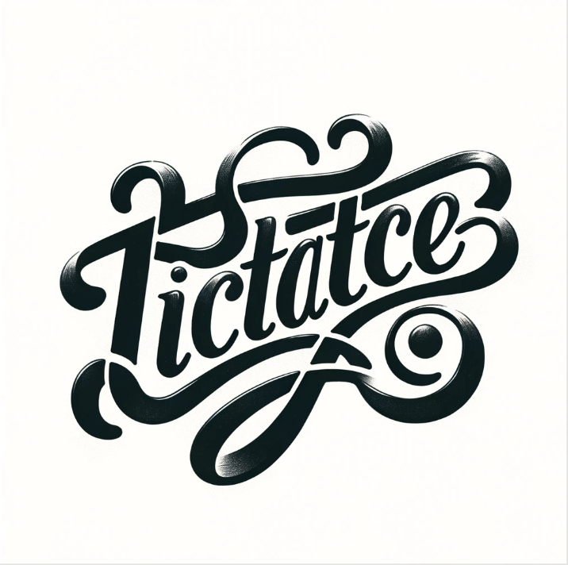

<p align="center">
     
</p>

# 목차

- [프로젝트 소개](#프로젝트-소개)
- [프로젝트 관심사](#프로젝트-관심사)
- [주요 기능](#주요-기능)
- [기술스택](#기술스택)
- [연락처](#연락처)

<br>

# 프로젝트 소개
- Flutter Tic Tac Toe

  <p align="center">
     
  </p>


<br>

# 프로젝트 구조

```
├─ lib
│  ├─ controllers
│  │  ├─ game_controller.dart
│  │  └─ game_history_provider.dart
│  ├─ main.dart
│  ├─ models
│  │  └─ game_model.dart
│  └─ views
│     ├─ game
│     │  └─ game_screen.dart
│     ├─ game_history
│     │  └─ game_history_screen.dart
│     ├─ game_settings
│     │  └─ game_settings_screen.dart
│     └─ home
│        └─ home_screen.dart

```

<br>

- Model: 게임의 상태, 게임 보드의 크기, 승리 조건, 플레이어 정보 등을 포함합니다.
- View: 게임 보드와 설정 화면 등 사용자가 상호작용하는 부분을 담당합니다.
  - GameScreen은 GameModel 인스턴스를 사용하여 렌더링.
- Controller: 사용자의 입력을 받아 모델을 업데이트하고, 뷰에 변경 사항을 알립니다.
  - GameController: GameModel 인스턴스를 통해 게임의 상태를 관리합니다. 사용자의 입력(예: 타일 선택)에 따라 GameModel의 상태를 업데이트합니다.
- Provider 사용: Provider를 사용하여 GameController와 같은 상태 관리 객체를 앱 전반에 걸쳐 공유합니다.

<br>

- 새 게임 시작
  - GameModel 생성: 사용자가 새 게임을 시작할 때, GameModel의 인스턴스가 생성됩니다. 이때, 게임의 기본 설정(예: 보드 크기, 승리 조건, 플레이어 마크와 색상 등)이 생성자를 통해 초기화됩니다.
  - GameScreen 이동: 앱은 GameScreen으로 화면을 전환되며 실제 게임이 시작되고 게임 로직과 상태는 GameModel 인스턴스에 의해 관리됩니다.
  - GameController는 GameModel의 initialModel이 제공되지 않은 경우, GameScreen은 새로운 게임을 위해 제공되고 사용자의 입력에 따라 게임을 진행합니다.

- 이전 게임 기록 불러오기
  - GameModel.fromHistory 생성: 사용자가 이전 게임 기록을 불러올 때, GameModel.fromHistory 팩토리 생성자를 사용하여 GameModel의 인스턴스가 생성됩니다. 이전 게임의 상태(예: 보드 상태, 수의 순서 등)를 기반으로 GameModel 인스턴스를 초기화합니다.
  - GameScreen에 전달: 생성된 GameModel 인스턴스는 GameScreen으로 전달됩니다. GameScreen에서는 didChangeDependencies를 통해 게임 컨트롤러 인스턴스를 가져오고, 이전 게임의 모델을 기반으로 화면을 구성합니다.

# 프로젝트 관심사

## 팩토리 패턴을 이용해 GameScreen 위젯 재사용하기

  - 히스토리 관리나 새로운 게임을 위해 GameScreen을 재사용하면 좋겠다고 생각했습니다. 이를 구현하기 위해 디자인 패턴 중 팩토리 패턴에서 아이디어를 얻었습니다. 팩토리 패턴은 객체 생성 과정을 캡슐화하여, 호출자가 특정 클래스의 인스턴스를 직접 생성하지 않고도 해당 인스턴스를 얻을 수 있게 하는 디자인 패턴입니다.

  - 팩토리 패턴을 다음과 같은 방식으로 적용해 보았습니다.

   - initialModel 매개변수 사용:
     - GameScreen 생성자에서 initialModel이라는 매개변수를 받음으로써, GameScreen은 제공된 모델을 기반으로 화면을 구성합니다. 제공된 모델이 있으면 이전 게임의 상태를 렌더링하고, 없으면 새 게임의 초기 상태를 설정합니다.
   - 모델 생성 로직의 캡슐화:
     - 새 게임을 시작할 때나 이전 게임 기록을 불러올 때 사용되는 GameModel의 인스턴스 생성 로직을 GameScreen 밖에서 수행하고, 생성된 GameModel 인스턴스를 GameScreen으로 전달합니다. GameModel 생성 로직을 GameScreen 사용 로직으로부터 분리합니다.
   - 조건에 따른 객체 생성:
     - GameModel.fromHistory와 같은 팩토리 메서드를 사용하여, 이전 게임의 상태를 로드하는 경우와 새 게임을 시작하는 때에 따라 다른 GameModel 인스턴스를 생성합니다

  - 이러한 방식으로 GameScreen과 GameModel의 관계를 설계함으로써, 어떤 상태의 게임을 시작할지에 따라 동적으로 GameScreen을 구성할 수 있게 됩니다.

  ### initState의 vs didChangeDependencies

  - 적절한 모델로 초기화하기 위한 비동기 작업을 위젯이 렌더링 되는 시점 이전에 완료될 필요가 있었고 이를 initState 내부에 필요한 로직을 작성했습니다. 하지만 게임 히스토리에서 게임 스크린을 불러올 때 이전 화면이 남아 있어서 정상적으로 렌더링 되지 않는 문제가 발생했습니다. initState 메소드는 위젯의 생명주기에서 단 한 번, 위젯이 생성될 때 호출되며 위젯의 상태를 초기화하기 위해 사용됩니다. 따라서 뒤로 가기를 클릭하여 사용자가 이전 화면으로 돌아가면 위젯 트리에서 위젯이 제거되었다가 다시 추가될 수 있습니다. 이 경우 initState는 다시 호출되지 않습니다.

  - 반면 didChangeDependencies는 사용자가 뒤로 가기를 클릭하면 위젯이 위젯 트리에 다시 추가될 때 호출됩니다. 따라서, 이전 게임의 상태를 복원하거나 새로운 게임의 초기 상태를 설정하는 로직을 didChangeDependencies 내에 구현하면, 사용자가 뒤로 가기를 클릭한 후에도 게임 상태가 적절하게 관리될 수 있습니다. didChangeDependencies 메소드는 initState 이후에 호출되며, 위젯의 의존성이 변경될 때마다 반복적으로 호출될 수 있습니다. 따라서 비동기 작업에 대한 안전한 시작점을 제공하여, 사용자 액션에 따라 필요한 모델을 인스턴스화해서 게임 스크린을 렌더링하게 됩니다. Provider로부터 받는 데이터가 변경되면 didChangeDependencies가 호출되어 위젯이 새로운 데이터에 맞게 자신을 업데이트할 수 있습니다.

  - 결국 didChangeDependencies 내에서 비동기 로직을 처리하면, 모든 의존성이 올바르게 설정된 후에 비동기 작업을 시작할 수 있으므로, 이전 게임의 상태를 올바르게 초기화하고 새 게임을 로드할 때 발생할 수 있는 문제를 방지할 수 있습니다. didChangeDependencies를 사용하면, 게임의 initialModel이 변경될 때마다 새 게임의 초기 상태를 설정하거나 이전 게임의 상태를 올바르게 로드하는 로직을 실행할 수 있습니다. 이는 GameScreen이나 관련 상태 관리 로직이 새로운 게임 데이터를 받을 때마다 정확히 반응할 수 있게 해 줍니다.

 <br>

# 주요 기능

 - 게임 셋팅

    <p align="center">
     
    </p>

  - 랜덤 마크

    <p align="center">
     
    </p>

  - 무르기 기능

    <p align="center">
     
    </p>


# 기술스택

- Front-end:
  - Dart, Flutter, Provider, Mockito

<br>

# 연락처

<table>
  <tr>
    <td align="center">
      <a href="https://github.com/donghyukkil">
        
      </a>
    </td>
  </tr>
  <tr>
    <td>
      <ul>
        <li><a href="https://github.com/donghyukkil">길동혁</a></li>
		    <li>asterism90@gmail.com</li>
	    </ul>
    </td>
  </tr>
</table>


